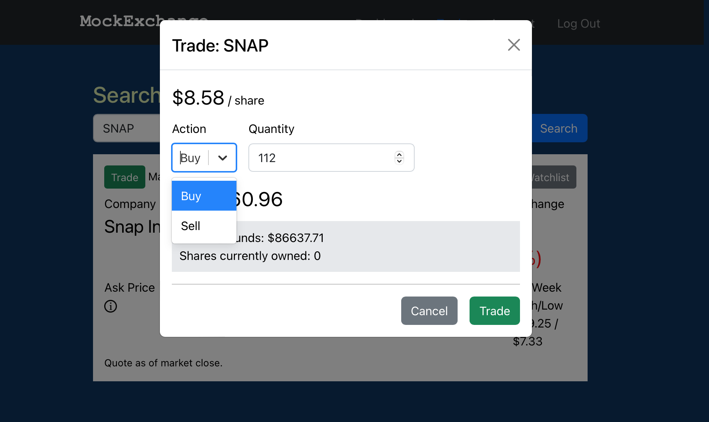

# Mock-Invest App

 

\_A fantasy stock trading app.

Logged in users are provided an initial fake $100,000 of which can be invested in real stocks to simulate the investment experience. Users can search for stocks and then trade them, or add them to their watchlist. Account data is kept up to date and is displayed on the dashboard along with holdings and some charts for a more visual experience.\_

 

See it in action [here](https://mockex.onrender.com). (Render may cause a delay in loading.)

 

Screenshot: 

## Details

### Server:

-  Coded with Python using Flask framework
-  Application factory design with separate modules for routes, models, database helpers and external API calls, keeps it easy to read and navigate
-  Communicates with the client via local REST API endpoints; logged in users provide a server-generated JSON web token to verify each request for data
-  Stock data is retrieved from IEX Cloud REST API
-  User account data is stored in a PostgreSQL database and generated, updated, and accessed using SQLAlchemy Object-Relational-Mapping

### Client:

-  Made with React Javascript
-  A JSON web token is provided upon successful login for accessing account data from the server
-  Utilizes React-Router for page navigation
-  Authentication context provides the entire app access to the token and the ability for logged in users to access protected routes
-  Account context gives access to account data within any of the protected routes
-  All server Axios requests are found in API.js for organization and reuseability
-  React-Google-Charts library presents a visually enticing dashboard experience
-  The trade page features a watchlist to keep watched stocks easily accessible and to avoid having to search
-  The account page not only contains account info, but displays all the users transactions
-  Uses Formik and Yup for better form validation

## Skills Developed

-  Using SQLAlchemy for more readable and organized database interaction
-  Making use of the React useCallback hook for several potentially data-heavy functions to only get call when needed
-  Using context in React to allow global or protected access to data
-  How to use cookies to store the JWT instead of localstorage
-  How to more organize a Python-Flask-Database application without circular imports (a tough one!)
-  Practicing better React component/logic decoupling
-  Form validation using Formik library

## Installation Instructions

1. Create a PostgreSQL database and have your username, password and database name ready
2. Sign up for a free trial at https://iexcloud.io to get an API access token
3. At the command line in the root directory run "bash setup.sh". When it's finished if everything was entered correctly, your server should be online. If you need to modify credentials edit the .env file found in the server directory.
4. Open a new command line and at the root directory run "cd client && npm start". This should launch the client in your browser or navigate to the URL provided in the terminal.

## Author

-  **Nick Schaefer** - _Full-Stack Software Developer_ - [Website](https://www.nschaefer.com/) | [LinkedIn](https://www.linkedin.com/in/nick-n-schaefer)
